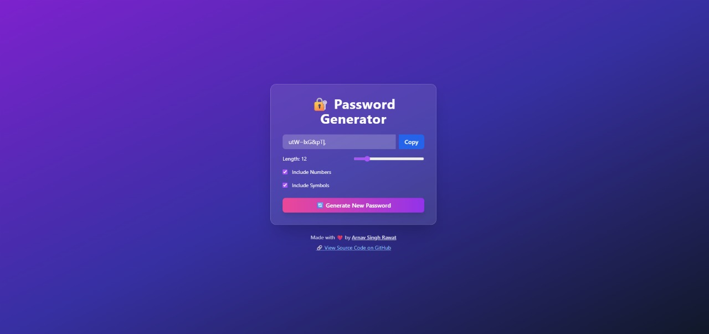

# 🔐 React Password Generator

A modern, responsive password generator built with React and Tailwind CSS. Create strong, random passwords with customizable options.

[](https://6862a0dc5e5b16aaa40b2b4a--passgenbyarnav.netlify.app/)


 <!-- Replace with actual screenshot -->

## Features

- 🎚️ Adjustable password length (8-32 characters)
- 🔢 Toggle numbers inclusion
- ✨ Toggle special characters inclusion
- 📋 One-click copy to clipboard with visual feedback
- 🎨 Beautiful gradient UI with glass morphism effect
- 📱 Fully responsive design
- 🔄 Manual regeneration button
- ⚡ Instant generation on settings change
- ✅ Toast notifications for user actions

## 🚀 Live Deployment

The application is deployed on Netlify:  
👉 [https://passgenbyarnav.netlify.app/](https://6862a0dc5e5b16aaa40b2b4a--passgenbyarnav.netlify.app/)

## Technologies Used

- React.js (Vite)
- Tailwind CSS
- React Hooks (useState, useEffect, useCallback, useRef)
- Netlify (Hosting)

## Installation

1. Clone the repository:
   ```bash
   git clone https://github.com/ArnavSinghRawat18/Password-Generator-using-react.git